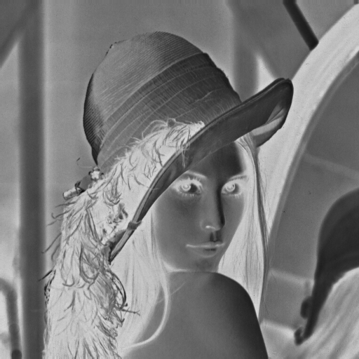

## HW2 Report 2020203090 한용옥

<br><br>

|문항 번호|완료 여부|
|:--:|:--:|
|1|**성공**|
|2|**성공**|
|3|**성공**|

<br><br><br><br><br><br><br><br><br><br>

## 비교를 위한 원본 흑백 사진 (512 * 512)


<br>

## 1. Gamma Transformation 구현 결과
위에서부터 $\gamma = 0.5, 1.5$ 로 변환한 이미지이다 


## 2. Negative transformation 구현 결과



<br><br><br><br><br><br><br><br><br>
<br><br><br><br><br><br><br><br><br>
<br><br>

## 3. Histogram Equalization 구현 설명

Histogram Equalization은 원본 픽셀의 누적 확률 분포를 균등분포의 것으로 만들어 픽셀들의 분포가 균등해지는 변환이다 원본 이미지 픽셀 값 $r$, 균등변환 후 이미지 픽셀 값 $s$, 각각의 확률분포 $p_r, p_s$ 에 대해

$$
\int_{0}^{r}{p_r(w) dw} = \int_{0}^{s}{p_s(w) dw} = \frac{s}{(L-1)}
$$

$$
\Rightarrow s = (L-1)\int_{0}^{r}{p_r(w) dw} = T(r)
$$

우리가 다루는 이미지는 흑백 `8bit` 디지털 이미지이므로 이산형으로 바꾸면
이미지의 가로, 세로, 픽셀값 빈도를 $W,H,n_j$ 라 하면 변환은 아래와 같다

$$
s_k = T(r_k) = 255\sum_{j=0}^{k}{p_r(r_j)} = \frac{255}{WH}\sum_{j=0}^{k}{n_j} \tag{1}
$$

원본 이미지 $R : \mathbb{R}^2 \rightarrow \mathbb{R}$, 균등변환 후 이미지 $S : \mathbb{R}^2 \rightarrow \mathbb{R}$ 에 대해 변환을 아래와 같이 수행하면 된다

$$
R(\mathrm{x})=r_k \rightarrow S(\mathrm{x}) = T(R(\mathrm{x})) = T(r_k) = \frac{255}{WH}\sum_{j=0}^{k}{n_j} \tag{2}
$$

파이썬으로는 아래와 같이 구현하였다
```python
# 모든 k([0,255]) 에 대한 빈도 누적합 배열 생성 (n_j의 0부터 k까지의 합에 대응)
cum_count = np.cumsum(np.bincount(src.ravel()))
# 식 1의 변환 수행
matched_val = cum_count * 255 / (src.shape[0] * src.shape[1])
# 디지털 이미지이므로 반올림 수행 및 범위 [0,255]로 제한 후 정수형으로 변환
matched_val = np.clip(np.floor(matched_val + 0.5), 0, 255).astype(np.uint8)
# 원본이미지 모든원소에 식 2의 변환 수행
result = matched_val[src]
```

<br><br><br><br><br><br><br><br><br>
<br><br><br><br><br><br><br><br><br><br>

## 3-2. Histogram Equalization 구현 결과
위에서부터 순서대로 원본, lena1, lena2를 Histogram Equalization 한 이미지이다


