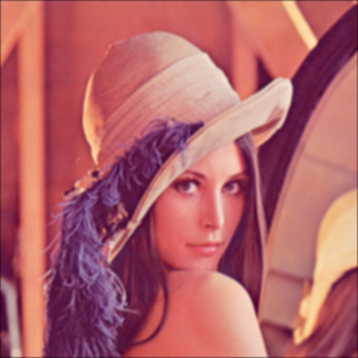
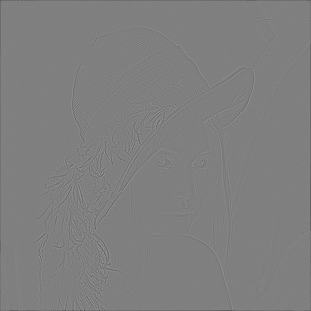
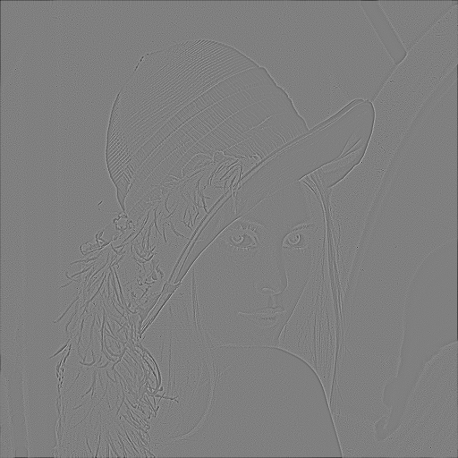
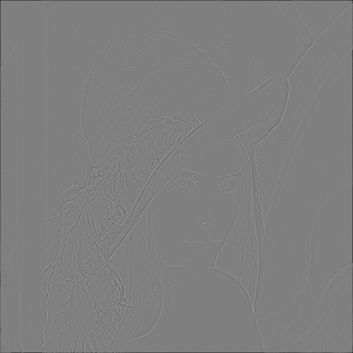
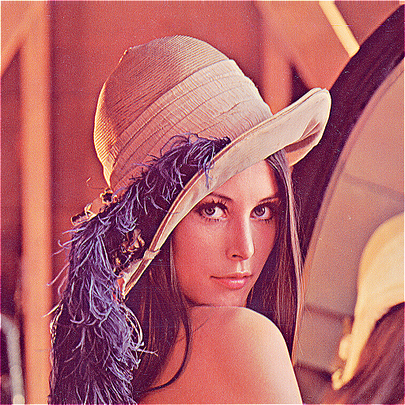

## HW3 2020203090 한용옥
<br>

### 프로그램 안내
본 프로그램은 파이썬으로 구현되었습니다
시작시 입력영상의 경로, 색 모드(`color` : 컬러, `gray` : 흑백) 를 입력받습니다

### 커널 구현
사용자로부터 $n$을 입력받아 한 변의 길이가 $2n+1$인 정사각형 형태의 커널을 넘파이 배열로 생성한다
<br>

#### Moving average
모든 원소의 합이 1 이고 균등한 커널이므로
모든 원소의 값이 $1/(2n+1)^2$ 인 정사각 커널을 반환하면 된다
<br>

#### Laplacian
정의에 의해 다음이 성립한다

$$
\nabla^{2} f = \frac{\partial^2 f}{\partial x^2} + \frac{\partial^2 f}{\partial y^2}
$$

$$
= f(x-1,y) + f(x+1,y) + f(x,y-1) + f(x,y+1) - 4f(x,y)
$$

$$
= \sum_{i=-n}^{n}\sum_{j=-n}^{n} {f(x+i,y+j)h[n+i,n+j]}
$$

$$
h = \begin{bmatrix}
0 & 1 & 0 \\\\
1 & -4 & 1 \\\\
0 & 1 & 0 \\\\
\end{bmatrix}
$$

따라서 임의 위치에서의 이미지 라플라시안은 커널 $h$와의 합성곱이며
이미지를 $h$ 로 합성곱 할 경우 값이 라플라시안인 이미지를 얻는다
<br>

#### Sharpening
이미지에 이미지의 이차 미분을 빼면 경계에서 값의 차이가 더 벌어져 sharpen효과가 생긴다
수식으로 나타내면

$$
\text{sharpened img}(x,y) = f(x,y) - \nabla^{2} f(x,y) 
$$

$$
= f(x,y) - h \* f(x,y) = (1-h) \* f(x,y)
$$

이때 $1$은 합성곱의 항등원이므로 $1-h$ 는 다음과 같다
$$
\text{Sharpening kernel}=1-h = \begin{bmatrix}
0 & 0 & 0 \\\\
0 & 1 & 0 \\\\
0 & 0 & 0 \\\\
\end{bmatrix} - \begin{bmatrix}
0 & 1 & 0 \\\\
1 & -4 & 1 \\\\
0 & 1 & 0 \\\\
\end{bmatrix} = \begin{bmatrix}
0 & -1 & 0 \\\\
-1 & 5 & -1 \\\\
0 & -1 & 0 \\\\
\end{bmatrix}
$$
<br><br><br><br><br><br><br><br><br><br>

### 커널 합성곱 구현
본 프로그램에서 커널 합성곱 구현은 함수로 구현되었으며 조건은 다음과 같다
1. 입력은 합성곱을 적용할 이미지, 커널이다
2. 패딩 등 전처리는 이미 완료된 이미지가 입력으로 들어온다고 가정한다
3. 2번에 의해 합성곱이 적용될 범위는 계산 중 이미지 픽셀이 존재하는 범위, 즉 가로 `[n, w-n]`, 세로 `[n, h-n]` 이다

이미지에서 합성곱 연산은 행렬에 대해 정의된다 (color인 경우 원소가 `[b,g,r]`인 행렬)
커널 $h$, 조건으로 주어진 반경 $n$ 과 특정 위치 $(x,y)$ 에 대해 다음의 식으로 정의된다

$$
f(x,y) \* h = \sum_{i=-n}^{n}\sum_{j=-n}^{n} {f(x+i,y+j)h[n+i,n+j]}
$$

행렬로 형식화하면 위치 $(x,y)$ 에서의 합성곱은 다음과 같다

$$
C(x,y) = F(x,y) \circ h
$$

$$
= \begin{bmatrix}
f(x-n, y-n) & ... & f(x, y-n) & ... & f(x+n, y-n) \\\\
... & ... & ... & ... & ... \\\\
f(x-n, y) & ... & f(x, y) & ... & f(x+n, y) \\\\
... & ... & ... & ... & ... \\\\
f(x-n, y+n) & ... & f(x, y+n) & ... & f(x+n, y+n) \\\\
\end{bmatrix} \circ \begin{bmatrix}
h[0, 0] & ... & h[0, 2n] \\\\
... & ... & ... \\\\
h[2n, 0] & ... & h[2n, 2n] \\\\
\end{bmatrix}
$$

$$
\circ \text{ 는 아다마르곱 , } \  f(x,y) \* h = \sum_{i,j}{C(x,y)_{ij}}
$$

따라서 이미지에 커널을 합성곱한 이미지를 얻는 함수는 다음과 같이 구현 가능하다

1. 원본 이미지로부터 원소가 $F(x, y)$ 인 배열 $F$를 생성한다. 이때 조건 3을 만족하며 생성한다
2. $F$의 모든 원소에 $h$ 를 아다마르 곱 한다
3. 2의 모든 원소에 $\sum_{i,j}$ 연산을 해 하나의 수로 만든다

실제 적용은 아래와 같다

```python
def apply_kernel(src, kernel):
    # 1번 수행
    win = np.lib.stride_tricks.sliding_window_view(src, 
                window_shape=kernel.shape, axis=(0, 1))
    # 2, 3번 수행
    out = (win * kernel).sum(axis=(-2, -1))
    return out
```
<br><br><br><br><br><br><br><br><br><br><br><br>

### 패딩 구현

본 프로그램에선 제로패딩을 구현하였다
단순히 이미지의 위아래에 크기가 `[n, w]`, 좌우로 크기가 `[h + 2n, n]`이고 원소가 모두 `0`인 배열을 붙이면 된다 구현은 크기가 `[h + 2n, w + 2n]`이고 원소가 `0`인 넘파이 배열을 생성한 후 패딩이 아닌 영역 `[n:n + h, n:n + w]`을 원본 이미지의 값으로 채웠다
실제 적용은 아래와 같다

```python
def apply_kernel(src, kernel):
    # 원소가 0이고 크기가 패딩을 더한 크기인 배열 생성
    size = (src.shape[0] + 2*n, src.shape[1] + 2*n) + src.shape[2:]
    out = np.zeros(size, dtype=src.dtype)
    # 원본 이미지영역 복사
    out[n:n+src.shape[0], n:n+src.shape[1], ...] = src
    return out
```
<br>

### 필터링

종합하여 커널을 만들고 출력이미지 크기변화없게 패딩을 추가하고 합성곱하는 순으로 필터링을 구현하였다

```python
def filtering(src, n, kernel):
    kernel = kernel(n)             # 커널 생성
    out = zero_padding(src, n)     # 패딩 추가
    out = apply_kernel(out, kernel)# 커널 합성곱
    out = rounding(out)            # 이미지 타입 변환 (to uint8)
    return out
```

<br><br><br><br>

## 필터링 결과
<br>

### 입력 영상
|||
|:--:|:--:|
||입력 이미지는 좌측의 `512 * 512` 크기의<br>컬러 Lena 이미지이다|

|||
|:--:|:--:|
|||
|`3*3`|`5*5`|
|||
|`7*7`|`11*11`|

### Moving average 결과
커널의 크기가 커질수록 평균을 계산하는 영역이 넓어지므로 각 픽셀의 값이 주변 픽셀들의 영향을 더 많이 받게 된다 그 결과, 세부적인 픽셀 성분이 점차 사라지고 영상 전체가 부드럽고 흐릿하게 변한다

또한 본 실험에서는 제로 패딩을 사용하였기 때문에 커널 크기가 커질수록 영상의 경계부에서 `0`값을 포함하는 영역이 늘어나 가장자리 부분이 점점 더 어두워지며 검은 테두리처럼 나타난다

|||
|:--:|:--:|
|||
|B 채널 라플라시안|G 채널 라플라시안|
|||
|R 채널 라플라시안|라플라시안 기반 sharpening|

### 라플라시안 시각화

라플라시안은 단순히 이차 미분 값이므로 값의 범위가 $[0, 255]$ 가 아니어서 보기에는 무리가 있다
따라서 라플라시안 필터를 거친 이미지를 아래의 밝기 변환을 통해 $[0, 255]$ 로 맞추어 시각화하였다

$$
M = \max_{x,y} f(x,y) ,\ m = \min_{x,y} f(x,y) \\\\
T(f(x,y)) = \frac{f(x,y) - M}{M - m}
$$

본 이미지에서는 윤곽선 부분이 세 컬러 모두 비슷하나 코의 윤곽선은 `R`이 변화가 약한 것을 볼 수 있다
<br>

### 라플라시안 기반 Sharpening

전체적으로 이미지가 선명히 변했으나 노이즈 또한 선명해짐을 알 수 있다