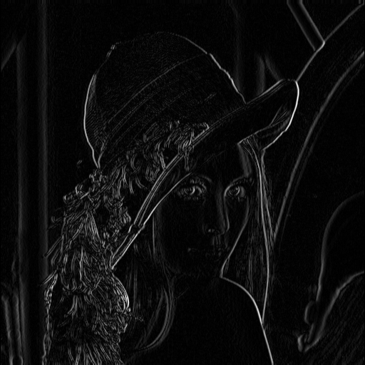
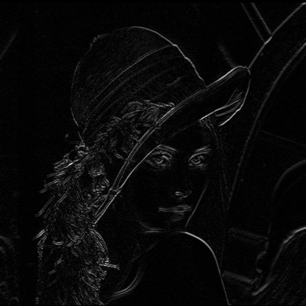
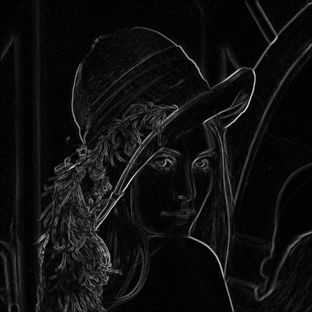
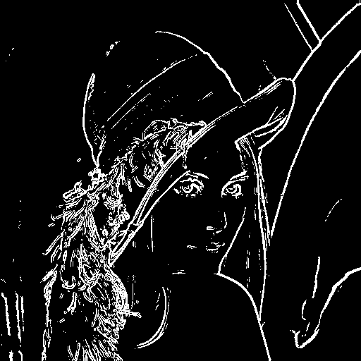
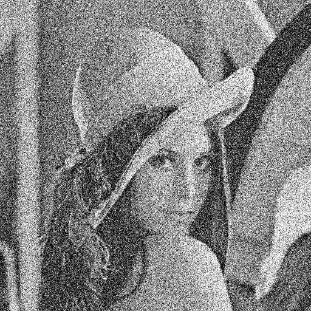
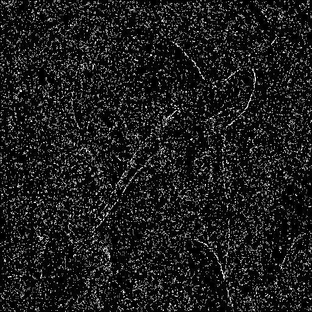
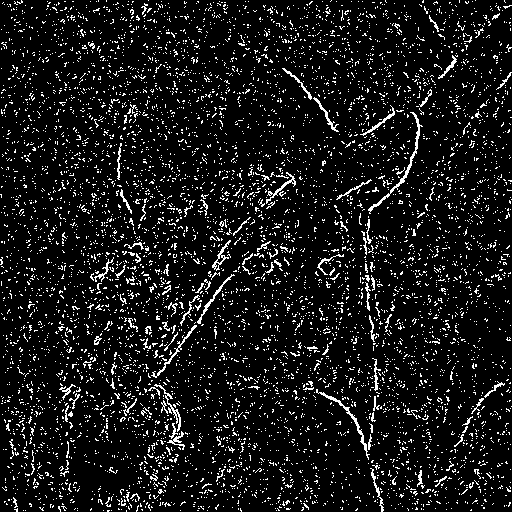
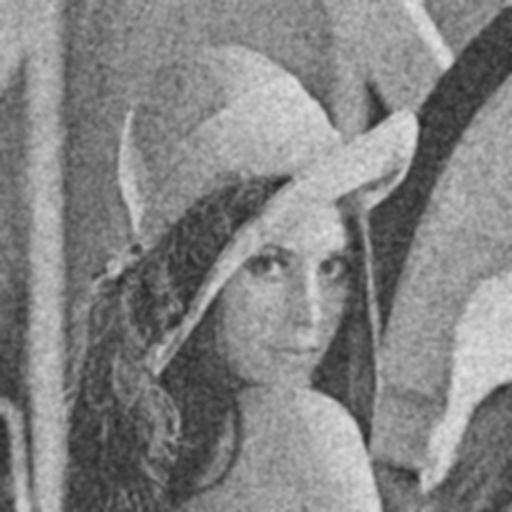
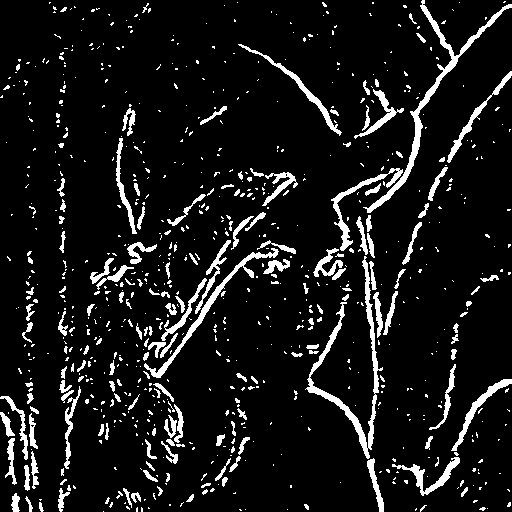

### HW5 Report 2020203090 한용옥
 

### 프로그램 설정
`main` 의 상수를 조정하여 경로나 설정을 바꿀 수 있다
|||
|:--:|:--:|
|`IMAGE_PATH`|원본 이미지 경로|
|`OUTPUT_PATH`|출력물을 저장할 폴더|
|`KEEP_TOP_PERCENT`|상위 몇 %를 엣지로 남길지에 대한 상수|
|`NOISE_SIGMAS`|가우시안 노이즈 sigma 강도|
|`GAUSS_CFGS`|(커널크기, 시그마) 목록|
 

### Sobel 마스크와 Reflect-101 패딩
Sobel 마스크는 다음과 같이 정의하였다.

$$
G_x = \begin{bmatrix}
-1 & 0 & 1 \\\\
-2 & 0 & 2 \\\\
-1 & 0 & 1
\end{bmatrix},\quad
G_y = G_x^T
$$

입력 영상을 $f(x,y)$ 라 할 때, 각 위치에서의 기울기는

$$
g_x(x,y) = f * G_x,\quad
g_y(x,y) = f * G_y
$$

로 계산하였다. 합성곱은 직접 구현한 3×3 필터 함수 `conv3x3_reflect101`를 이용하며,
가장자리는 OpenCV의 `BORDER_REFLECT_101`과 동일한 규칙으로 1픽셀 패딩을 수동으로 구현했다. 

패딩된 이미지를 만들고, `np.lib.stride_tricks.sliding_window_view`를 사용하여 `3×3` 윈도우를 
슬라이딩하며 커널과 원소곱 후 합을 내는 방식으로 합성곱을 수행하였다. 
 

### 에지 강도와 상위 n% thresholding
에지 강도 $S = |g_x| + |g_y|$ 로 정의하여 사용하였다.
단순히 고정된 스칼라 threshold를 쓰지 않고, **상위 n% 이상만 에지로 남기는 방식**으로 구현하였다.
에지 강도 영상 $S$의 상위 $p$%를 에지로 남기기 위한 임계값 $T$는 아래와 같이 정의하였다

- 임계값 $T =$ 전체 픽셀의 상위 $n$% 값

이후 이 임계값에 대해

$$
\text{edge}(x,y) =
\begin{cases}
255, & S(x,y) \ge T \\\\
0, & \text{otherwise}
\end{cases}
$$

형태의 이진 에지 영상을 생성한다.

프로그램에서는 이를 `threshold_for_top_percent`와 `binarize` 함수로 분리하였고,
상위 몇 %를 남길지는 `KEEP_TOP_PERCENT` 상수로 관리한다.
(본 실험에서는 `KEEP_TOP_PERCENT = 9`) 

      

### Sobel 에지 검출 구현 요약
1. Lena 영상을 그레이스케일로 읽어온다.
2. 수동 구현한 Sobel 필터로 $g_x, g_y$를 계산한다.
3. 절대값 $|g_x|, |g_y|, |g_x|+|g_y|$를 구한 뒤, 시각화를 위해 `[min, max]` → `[0, 255]` 로 
선형 스케일링 후 `uint8`로 변환한다. 
4. $S = |g_x|+|g_y|$에 대해 **상위 9%** 만 255로 남도록 thresholding을 수행한다.
5. 중간 결과 및 최종 에지 이미지를 저장한다.

 

### Sobel 에지 검출 실행 결과
|||
|:--:|:--:|
|||
| $\|g_x\|$ 영상 | $\|g_y\|$ 영상 |
|||
| $\|g_x\|+\|g_y\|$ (edge strength)|상위 9% thresholding 결과|

  

### Sobel 에지 검출 결과 분석
$|g_x|$ 영상에서는 수평 방향으로 밝기 변화가 큰 영역(수직 에지)이 강하게 나타나고,
$|g_y|$ 영상에서는 수직 방향으로 밝기 변화가 큰 영역(수평 에지)이 강하게 나타난다.
$|g_x|+|g_y|$는 두 방향의 기울기를 모두 더한 값이라, 전체적인 에지 구조가 강조된다.

상위 9%만 에지로 남겼기 때문에, 세밀한 약한 에지는 상당 부분 제거되지만  
너무 적은 비율만 남길 때와 비교하면 윤곽선뿐 아니라 머리카락 덩어리나
얼굴 내부의 일부 구조도 함께 보존된다.  
상위 비율을 더 줄이면 에지의 개수는 감소하고, 가장 강한 윤곽선 위주의 선들만 남게 된다는 점을
상대적으로 비교할 수 있다.

 

### Gaussian noise 추가 방법
가우시안 노이즈는 OpenCV의 `cv.randn` 함수를 이용해 영상과 동일 크기의 노이즈 행렬을 만들고,
이를 원본 영상에 더하는 방식으로 구현하였다.
프로그램에서는 `sigma_frac = 0.25`로 설정하였다.  

 

### Noise가 추가된 영상, 에지 탐색 결과
|||
|:--:|:--:|
|||
|Gaussian noise $\text{sigma\_frac} = 0.25$ 추가|상위 9% thresholding 에지 결과|
 

### 결과 분석
노이즈가 추가된 영상은 전체적으로 입자성 요철이 생기며,
평탄해야 할 영역에도 밝기 변화가 눈에 띄게 나타난다.  
다만 $\text{sigma\_frac}=0.25$이므로 원본 구조가 완전히 망가질 정도는 아니며,
얼굴과 물체의 형태는 여전히 잘 식별된다.
Sobel 필터는 밝기 변화의 크기에만 반응하기 때문에, 노이즈로 인해 생긴 진동도 $|g_x|, |g_y|$에 반영된다.  
그 결과 $S = |g_x|+|g_y|$의 값 분포가 전반적으로 커지고,
일부 노이즈 패턴이 큰 기울기를 만들어 상위 9% 안에 포함된다.
percentile 기반 thresholding 덕분에 약한 노이즈 에지는 대부분 걸러지지만  
노이즈가 존재하는 이상 일부 강한 잡음 에지는 상위 9%에 포함되어 점이나 짧은 조각 형태로 나타난다.  

  

### Gaussian smoothing 구현
Gaussian filter에 따른 효과를 관찰하기 위해 Sobel을 적용하기 전,
OpenCV의 `GaussianBlur`를 사용해 영상에 스무딩 필터를 적용하였다.  

가우시안 필터는 $G(x,y) = C \exp\left(-\frac{x^2 + y^2}{2\sigma^2}\right)$
형태이며, 커널 크기와 $\sigma$ 는 각각 $(3, 1)$, $(9, 2)$ 두 가지 설정으로 실험하였다.
커널 크기가 커지고 $\sigma$ 가 커질수록 더 넓은 주변 픽셀을 섞어서 평균 내기 때문에 블러가 강해진다.  
$(3,1)$은 비교적 작은 커널이지만 $\sigma$가 커서 짧은 스케일의 노이즈와 세밀한 패턴을 꽤 강하게 평탄화하고,  
$(9,2)$는 큰 커널과 큰 $\sigma$를 사용하여 더 강한 스무딩을 수행한다.

 

### 4.2 Gaussian smoothing + Sobel 에지 결과

|||
|:--:|:--:|
|||
|Gaussian smoothing `3×3`, $\sigma=1$|상위 9% 에지 결과|
|||
|Gaussian smoothing `9×9`, $\sigma=2$|상위 9% 에지 결과|

  

### 4.3 결과 분석

**중간 정도 smoothing $3×3, (\sigma=1)$**

작은 커널이지만 $\sigma=1$이라 노이즈와 세밀한 질감이 상당히 완화된다.  
Sobel 에지 결과는 노이즈에 의해 생기던 잔잔한 에지들이 눈에 띄게 감소하고,
얼굴 윤곽과 모자 등 주요 구조는 비교적 잘 유지된다.
상위 9% threshold를 유지했기 때문에 에지 픽셀 수는 원본 대비 크게 변하지 않지만,
상위 9% 안에 포함되는 픽셀들 중에서 실제 구조에 대응하는 에지 비율이 높아져 에지 지도의 품질이 개선된다.

**강한 smoothing $9×9, (\sigma=2)$**

큰 커널과 큰 $\sigma$를 사용하여 노이즈뿐만 아니라 머리카락, 작은 주름, 얼굴 내부의 세밀한 패턴까지 크게 평탄화한다.  
이 상태에서 Sobel을 적용하면 노이즈성 에지는 크게 줄어드는 대신, 윤곽선이 두꺼워지고 모서리가 둥글어지는 등 구조가 단순해진다.
상위 9% 에지만 남겨도 남는 에지는 거의 큰 윤곽 위주로 제한되며, 세부 구조 정보는 상당 부분 사라진 것을 확인할 수 있다.

요약하면,

- Gaussian smoothing은 **노이즈가 많은 영상에서 에지 지도를 안정화시키는 역할**을 하지만  
  필터의 강도가 세질수록 세밀한 구조까지 함께 사라져 디테일 손실이 커진다.
- $(3,1)$ 설정은 노이즈와 잔잔한 에지를 줄이면서 주요 구조를 상당 부분 보존하는 절충에 가깝고,  
  $(9,2)$ 설정은 노이즈 억제 효과는 크지만 그만큼 구조 정보 손실도 커지는 모습을 보인다.

 

### 5. 결론
1. Sobel 마스크와 직접 구현한 reflect-101 패딩, `3×3` 합성곱을 통해 $g_x, g_y$ 를 계산하고,
$|g_x|+|g_y|$ 를 에지 강도로 사용하였다.
2. 고정 threshold 대신 **상위 n%만 에지로 남기는 percentile 기반 thresholding**을 적용하여,
영상마다 스케일이 달라도 비슷한 비율의 강한 에지를 얻을 수 있게 했다.
3. Gaussian noise를 추가하면 에지 강도에 잡음이 그대로 반영되어,
noise level이 높을수록 의미 없는 에지가 증가한다.
4. 노이즈가 추가된 영상에 대해 Gaussian smoothing을 적용하고 Sobel 에지를 구하면,  
   필터 강도에 따라 노이즈 제거와 구조 보존 사이의 trade-off가 뚜렷하게 나타난다.  
   적절한 커널 크기와 $\sigma$를 선택하는 것이 실제 응용에서 중요한 설계 요소임을 확인할 수 있었다.
