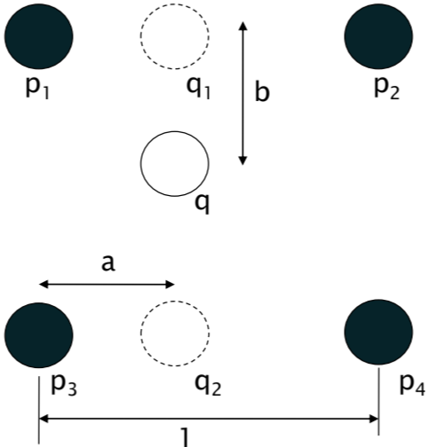
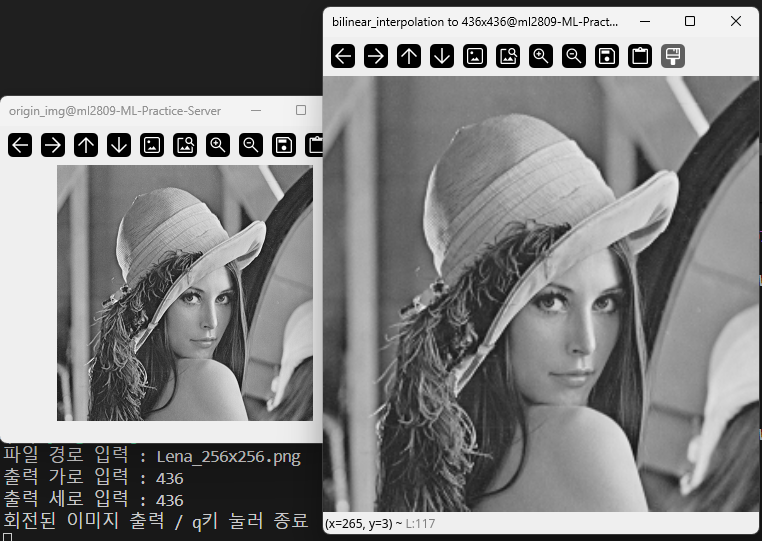
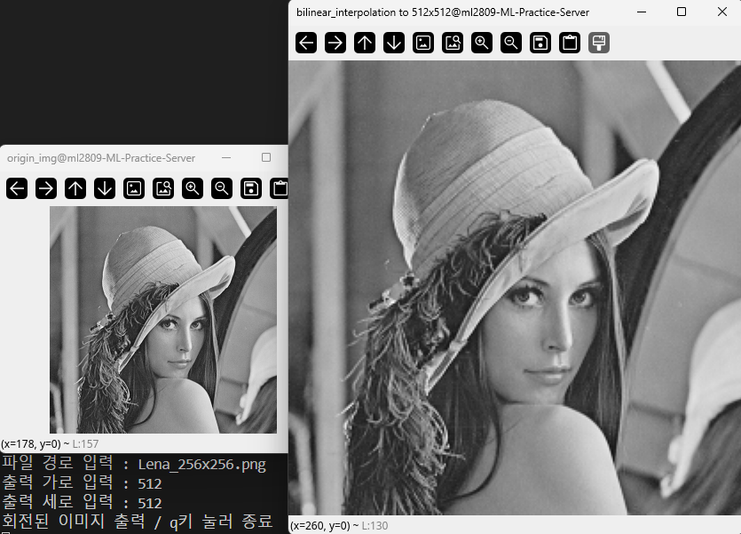
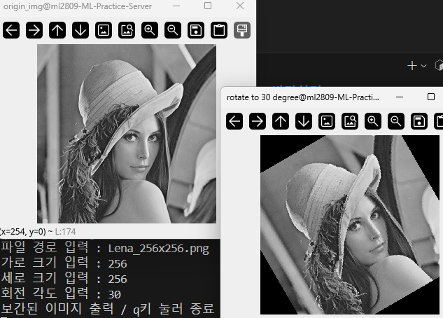
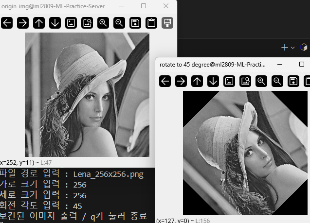
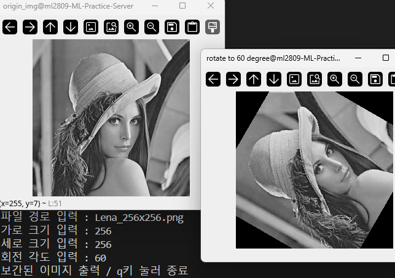

## HW1 보고서 2020203090 한용옥
<br>

## 구현방향, 방법 설명
<br>

### 1

||||
|:--|:--|--:|
||출력 이미지의 특정 좌표 픽셀 값 $q$을 결정하기 위해<br>원본 이미지의 4개 픽셀 값 $p_1, p_2, p_3, p_4$가 필요하다||

출력 이미지의 좌표계를 원본 이미지에 맞추면 쉽게 $p$들을 결정할 수 있다
두 이미지의 좌상단 점을 원점으로 고정하고 변환한다
원본 이미지 크기 $x_{origin}, y_{origin}$, 출력 이미지 크기 $x_{output}, y_{output}$,
출력 이미지 특정 픽셀의 좌표 $[x_q, y_q]^T$, 대응되는 원본 이미지 좌표계의 좌표를 $[x_p, y_p]^T$ 라 하면 아래 수식이 성립한다 

$$
\begin{bmatrix} x_p \\\\ y_p \end{bmatrix}
= \begin{bmatrix} \frac{x_{origin}}{x_{output}} & 0 \\\\ 0 & \frac{y_{output}}{y_{output}} \end{bmatrix} \begin{bmatrix} x_q \\\\ y_q \end{bmatrix} \tag{1}
$$

위 그림에서 보듯 $p_1, p_2, p_3, p_4$ 픽셀의 위치는 아래와 같다
|$p_1$|$p_2$|$p_3$|$p_4$|
|:--:|:--:|:--:|:--:|
|$\begin{bmatrix} floor(x_p) \\\\ floor(y_p) \end{bmatrix}$|$\begin{bmatrix} 1+floor(x_p) \\\\ floor(y_p) \end{bmatrix}$|$\begin{bmatrix} floor(x_p) \\\\ 1+floor(y_p) \end{bmatrix}$|$\begin{bmatrix} 1+floor(x_p) \\\\ 1+floor(y_p) \end{bmatrix}$|

원본이미지 $S : \mathbb{R}^2 \rightarrow \text{픽셀 값}$ 이라 하면 아래와 같다
$$
P = \begin{bmatrix} p1 & p2 \\\\ p3 & p4 \end{bmatrix}
= \begin{bmatrix} \begin{bmatrix} floor(x_p) \\\\ floor(y_p) \end{bmatrix} & \begin{bmatrix} 1+floor(x_p) \\\\ floor(y_p) \end{bmatrix} \\\\
                  \begin{bmatrix} floor(x_p) \\\\ 1+floor(y_p) \end{bmatrix} & \begin{bmatrix} 1+floor(x_p) \\\\ 1+floor(y_p) \end{bmatrix} \end{bmatrix}
$$

바이리니어 보간법 공식은 아래와 같이 행렬곱으로 변환 가능하다
$$
q = (1-a)(1-b)p_1 + a(1-b)p_2 + (1-a)bp_3 + abp_4
$$

$$
= \begin{bmatrix} 1-b & b \end{bmatrix}
\begin{bmatrix} p1 & p2 \\\\ p3 & p4 \end{bmatrix}
\begin{bmatrix} 1-a \\\\ a \end{bmatrix} \tag{2}
$$

따라서 보간은 아래 의사코드로 구할 수 있다
```python
def bilinear_interpolation(S:원본 이미지):
    출력 크기에 맞는 좌표 행렬 O 생성
    O의 모든 원소에 대해 식 (1) 적용
    O의 모든 원소 o로부터 [[p1, p2], [p3, p4]]가 원소가 되는 행렬 P 생성
    O의 모든 원소 o로부터 [1-b, b]가 원소가 되는 행렬 B 생성
    O의 모든 원소 o로부터 [1-a, a]^T가 원소가 되는 행렬 A 생성
    O의 모든 원소에 대해 BAP 연산 적용 (식 2)
    O 반환 
```
본 프로그램에서는 python과 numpy행렬 계산 메서드를 이용해 위 과정을 그대로 구현하였다

### 2

원본이미지 $S : \mathbb{R}^2 \rightarrow \text{픽셀 값}$, 회전변환 이미지 $O : \mathbb{R}^2 \rightarrow \text{픽셀 값}$ 라 하면 중심회전변환 $T : \mathbb{R}^2 \rightarrow \mathbb{R}^2$ 에 대해 아래 관계가 성립한다

$$
S(\mathbf{x}) = O(T(\mathbf{x}))
$$

반대로 생각하면 $O$ 좌표계의 특정 위치 $\mathbf{y}$ 가 $S$ 좌표계의 어느점에서 왔는지 변환 가능하면 아래식을 통해 원본 이미지로 부터 회전 이미지를 재구성할 수 있다

$$
\mathbf{y} = T(\mathbf{x}) \rightarrow G(\mathbf{y}) = \mathbf{x} ,\ O(G(\mathbf{y})) = S(\mathbf{x})
$$

변환 전, 후의 크기가 같으므로 가로크기를 $W$, 세로크기를 $H$ 라 하자 
중심회전변환은 이미지의 중심점을 원점으로 이동, 각도 $\theta$ 반시계 회전, 이미지의 중심점을 원래 위치로 이동 순으로 이뤄진다

#### 이미지의 중심점을 원점으로 이동
전체가 가로 $-\frac{W}{2}$, 세로 $-\frac{H}{2}$ 만큼 움직이므로 아래 벡터를 더하면 된다
$$
-V = -\frac{1}{2} \begin{bmatrix}W \\\\ H\end{bmatrix}
$$

#### 각도 $\theta$ 반시계 회전
회전행렬은 $\begin{bmatrix}cos(\theta) & sin(\theta) \\\\ -sin(\theta) & cos(\theta)\end{bmatrix}$ 지만 이는 수학 좌표계에서의 회전 행렬이고 이미지 좌표계는 아래 방향이 $y$가 커지는 방향이므로 변환행렬은 이미지좌표계로의 기저변환행렬$\begin{bmatrix}1 & 0 \\\\ 0 & -1\end{bmatrix}$ 와 $\begin{bmatrix}1 & 0 \\\\ 0 & -1\end{bmatrix}^{-1}$을 앞뒤로 곱한 아래의 행렬이다
$$
R = \begin{bmatrix}1 & 0 \\\\ 0 & -1\end{bmatrix}
\begin{bmatrix}cos(\theta) & sin(\theta) \\\\ -sin(\theta) & cos(\theta)\end{bmatrix}
\begin{bmatrix}1 & 0 \\\\ 0 & -1\end{bmatrix} =
\begin{bmatrix}cos(\theta) & -sin(\theta) \\\\ sin(\theta) & cos(\theta)\end{bmatrix}
$$

#### 이미지의 중심점을 원래 위치로 이동
전체가 가로 $\frac{W}{2}$, 세로 $\frac{H}{2}$ 만큼 움직이므로 아래 벡터를 더하면 된다
$$
V = \frac{1}{2} \begin{bmatrix}W \\\\ H\end{bmatrix}
$$

변환 전의 위치 $\mathbf{x}$, 변환 후의 위치 $\mathbf{y}$, 항등행렬 $I$ 라 하자
위의 변환을 종합하여 아래의 관계가 성립한다
$$
\mathbf{y} = T(\mathbf{x}) = R(\mathbf{x} - V) + V = R\mathbf{x} + (I - R)V
$$

$G(\mathbf{y})$ 는 다음과 같이 찾아진다
$$
\mathbf{y} = R\mathbf{x} + (I - R)V \rightarrow R\mathbf{x} = \mathbf{y} - (I - R)V
$$

$$
\rightarrow \mathbf{x} = R^{-1}\mathbf{y} - R^{-1}(I - R)V
\rightarrow \mathbf{x} = R^{-1}\mathbf{y} - (R^{-1} - I)V = G(\mathbf{y})
$$

따라서 회전 변환은 아래 의사코드로 구할 수 있다
```python
def rotate(S:원본 이미지):
    출력 크기에 맞는 좌표 행렬 O 생성
    O의 모든 원소에 대해 G적용
    O의 모든 원소 o에 대해 o = S(o)
    O 반환 
```
본 프로그램에서는 python과 numpy행렬 계산 메서드를 이용해 위 과정을 그대로 구현하였다

<br><br><br><br><br><br><br>

## 1-1 실행결과
|||
|:--:|:--:|
|||
|출력크기 : 436 * 436|출력크기 : 512 * 512|

## 1-2 실행결과
||||
|:--:|:--:|:--:|
||||
|출력크기 : 256 * 256 / 회전 각도 : 30도|출력크기 : 256 * 256 / 회전 각도 : 45도|출력크기 : 256 * 256 / 회전 각도 : 60도|

<br><br><br><br><br><br><br><br><br><br><br><br><br><br><br><br><br><br><br><br><br>

## 1-1 실행결과 보충
### 436 * 436


### 512 * 512


