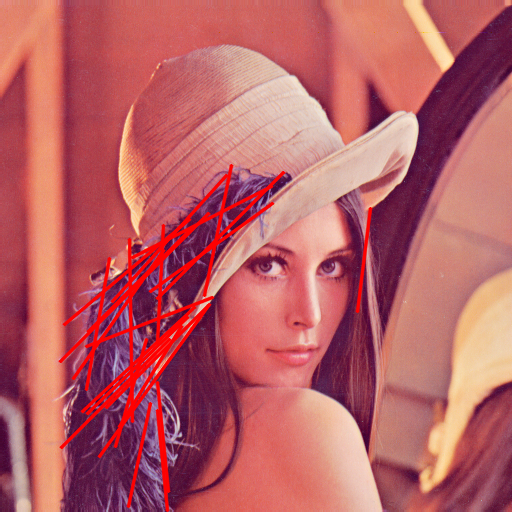
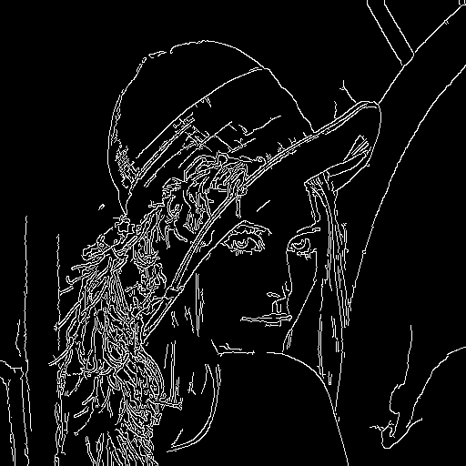
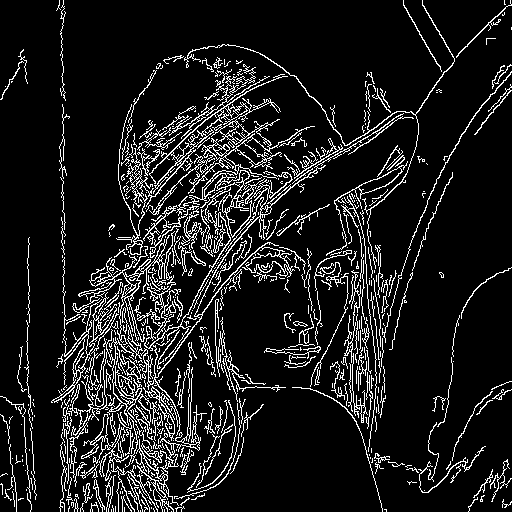
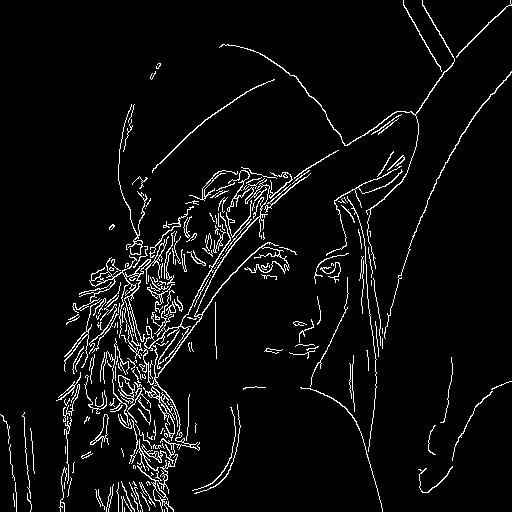
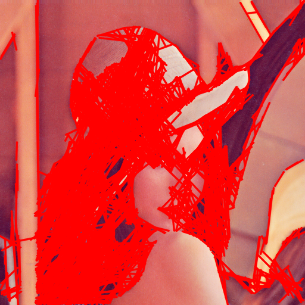

## Hough Transform 실험 보고서 2020203090 한용옥
 

### 1. 파라미터 설명

|||
|:--:|:--:|
|**rho**|누산기의 $\rho$ 해상도(픽셀). 일반적으로 1 사용.|
|**theta**|각도 해상도(라디안). 보고서/코드에서는 $1^\circ$(≈0.01745rad).|
|**threshold**|누적표 임계치. 이 값 이상 표를 받은 버킷만 선분 후보가 된다.   값이 낮으면 약한 선도 검출되나 오검출↑, 높으면 강한 선만 남는다. |
|**minLineLength**|선분의 최소 길이(픽셀). 짧은 단편 라인을 거른다.|
|**maxLineGap**|끊긴 에지들을 같은 선분으로 묶어줄 최대 간격(픽셀).   값을 키우면 단속 라인이 이어짐(연결력↑) vs 오연결 위험↑. |
|**Canny (low, high, aperture)**|에지 민감도 조절. low/high를 낮추면 약선/노이즈 모두↑, 높이면 강선 위주로 안정화.|

### 2. 실험 방법
**데이터**: 동일 원본 이미지 1장  
**고정/변동 설정**  
  1) **threshold**: $\rho=1$, $\theta=1^\circ$, `minLineLength=30`, `maxLineGap=10`, `Canny(50,150,ap=3)` 고정.  
     `threshold ∈ {30, 50, 80, 120}`로 변화.  
  2) **minLineLength**: `threshold=50`, `maxLineGap=10` 고정.  
     `minLineLength ∈ {10, 30, 60, 100}`로 변화.  
  3) **maxLineGap**: `threshold=80`, `minLineLength=40` 고정.  
     `maxLineGap ∈ {0, 5, 10, 20}`로 변화.  
  4) **Preset-Weak**(약선 강조): Canny(30,90), `threshold=20`, `minLineLength=10`, `maxLineGap=20`.  
  5) **Preset-Strong**(강선 위주): Canny(100,200), `threshold=120`, `minLineLength=80`, `maxLineGap=5`.

|**Threshold 변경 실험 결과**||
|:--:|:--:|
|||
|(T=30, minL=30, gap=10, Canny 50/150)|(설정 동일)|
|||
|(T=50)|(설정 동일)|
|||
|(T=80)|(설정 동일)|
|||
|(T=120)|(설정 동일)|

|**minLineLength 변경 실험 결과**||
|:--:|:--:|
|||
|(minL=10, T=50, gap=10, Canny 50/150)|(설정 동일)|
|||
|(minL=30)|(설정 동일)|
|||
|(minL=60)|(설정 동일)|
|||
|(minL=100)|(설정 동일)|

|**maxLineGap 변경 실험 결과**||
|:--:|:--:|
|||
|(gap=0, T=80, minL=40, Canny 50/150)|(설정 동일)|
|||
|(gap=5)|(설정 동일)|
|||
|(gap=10)|(설정 동일)|
|||
|(gap=20)|(설정 동일)|

|**Preset—Weak/Strong 변경 실험 결과**||
|:--:|:--:|
|||
|(Canny 30/90, T=20, minL=10, gap=20)|(Canny 100/200, T=120, minL=80, gap=5)|
|||
|(동일 설정)|(동일 설정)|

            

### 3.5 요약
**threshold ↓**: 약한 에지까지 선분으로 많이 뜸. 텍스처나 노이즈도 선분화되어 짧은/조각난 라인 급증. 같은 설정에서 `minLineLength`가 낮으면 더 심하게 늘고, `maxLineGap`이 크면 여러 조각이 한 선으로 이어져 긴 선분처럼 보이기도 함
**threshold ↑**: 누적표가 높은 곳만 통과해서 강한 구조선 위주로만 남음 배경 텍스처는 대부분 사라져 화면이 깨끗해지지만, 약한/부분 가려진 선은 누락 `maxLineGap`이 작으면 끊긴 구간에서 더 잘 끊김
**minLineLength ↓**: 짧은 단편 라인까지 통과해 검출 개수 증가. 한 구조선이 여러 짧은 선분으로 **분절**되어 카운트만 늘어나는 경향 텍스처가 많은 영역에서 특히 복잡해 보임
**minLineLength ↑**: 짧은 잡선이 정리되고 뼈대가 되는 긴 구조선만 남음 다만 실제로 짧게 드러나는 유효 선(예: 일부만 보이는 경계)은 함께 사라질 수 있음 
**maxLineGap ↓(0~소)**: 단속 구간에서 쉽게 끊겨 여러 개의 짧은 선분으로 나뉨 보수적이라 오연결은 줄지만, 선의 연속성이 떨어짐
**maxLineGap ↑**: 끊긴 에지를 잘 이어 길게 만들어 주므로 가려짐/노이즈가 있어도 한 줄로 합쳐짐 대신 서로 가까운 다른 에지까지 잘못 연결될 가능성이 커짐 
**Preset-Weak(낮은 Canny, 낮은 threshold, 낮은 minL, 큰 gap)**: 약한 선·배경 텍스처까지 광범위 검출 결과 이미지가 풍부하지만 과검출/오연결이 두드러짐 후처리(ROI, 방향 필터, 평행성/직교성 제약)를 쓰면 품질이 좋아짐 
**Preset-Strong(높은 Canny, 높은 threshold, 높은 minL, 작은 gap)**: 뚜렷한 구조선만 깔끔히 남음시각적으로 안정적이지만 희미한 윤곽이나 부분 선은 누락 조명 변화가 크면 놓치는 게 생김

 

### 4.1 **약한 Line까지 검출**하려면 어떻게 설정하나? 단점은?
- **권장 설정 방향**:  
  - Canny 임계 **낮춤**(예: 30/90) → 약한 에지도 유지.  
  - Hough `threshold` **낮춤**(예: 20~40) → 적은 표에도 선분 채택.  
  - `minLineLength` **낮춤**(예: 10~30) → 짧은 약선도 통과.  
  - `maxLineGap` **상향**(예: 15~25) → 끊어진 약선을 이어줌.
- **단점(트레이드오프)**: 잡음/텍스처가 **과검출**되기 쉽고, 잘못된 연결 증가. 후처리(ROI 제한, 방향/평행성 필터, 최소 교차 규칙 등) 없으면 품질 저하.

 

### 4.2 **강한 Line만 검출**하려면 어떻게 설정하나? 단점은?
- **권장 설정 방향**:  
  - Canny 임계 **상향**(예: 100/200) → 약한 에지 제거.  
  - Hough `threshold` **상향**(예: 100~150) → 강한 직선만 채택.  
  - `minLineLength` **상향**(예: 60~100) → 긴 구조선만 남김.  
  - `maxLineGap` **축소**(예: 0~5) → 무리한 연결 방지.
- **단점**: 희미하거나 부분적으로 가려진 중요 구조선이 **누락**. 실제 환경(조명 변화, 질감)에서 **재현성**이 떨어질 수 있음.
